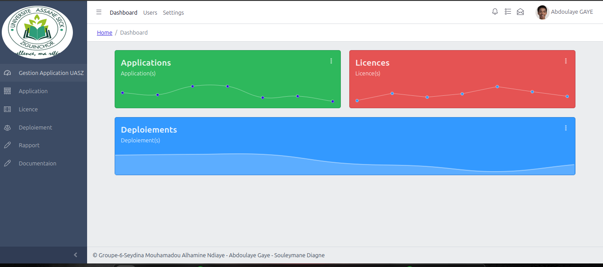
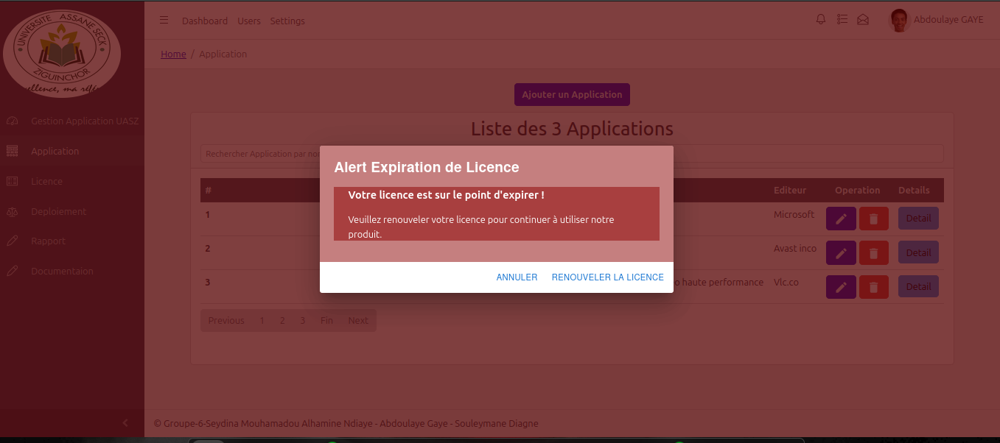
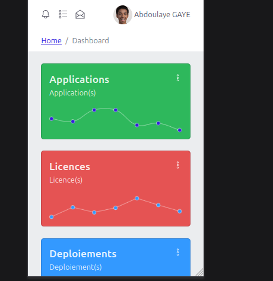

# [Gestion des applications de l’UASZ](https://justboil.me/tailwind-admin-templates/free-react-dashboard/)

### Gestion des applications de l’UASZ Page d'accueil



### Les alerts de fin de licence



### Gestion des application de l'UASZ

**Gest des applications de UASZ** est une plateform degner pour geree les applications au sein de l'universite

- Fabriquer avec **Spring-Boot**, **React**, **HTML, CSS** BD & **MariaDB**
- **React Redux** state library &mdash; [Info](https://react-redux.js.org/)
- **Dark mode**
- **Styled** scrollbars
- Composants réutilisables

## Table des matières

- [Gestion des applications de l’UASZ](#gestion-des-applications-de-luasz)
  - [Gestion des applications de l’UASZ Page d'accueil](#gestion-des-applications-de-luasz-page-daccueil)
  - [Les alerts de fin de licence](#les-alerts-de-fin-de-licence)
  - [Gestion des application de l'UASZ](#gestion-des-application-de-luasz)
  - [Table des matières](#table-des-matières)
  - [Mise en page réactive](#mise-en-page-réactive)
    - [Mobile \& tablette](#mobile--tablette)
      - [Installation Instructions](#installation-instructions)
    - [Clonage](#clonage)
      - [Pour le Back-end](#pour-le-back-end)
      - [Pour le Front-end](#pour-le-front-end)
  - [Docs](#docs)
  - [Prise en charge du navigateur](#prise-en-charge-du-navigateur)
  - [Membre de l'equipe](#membre-de-lequipe)
    - [Seydina Mouhamed Al Hamine Ndiaye](#seydina-mouhamed-al-hamine-ndiaye)
    - [Souleymane Diagne](#souleymane-diagne)
    - [Abdoulaye Gaye](#abdoulaye-gaye)
  - [Useful Links](#useful-links)

## Mise en page réactive

### Mobile & tablette

Disposition mobile avec menu caché et cartes et tableaux pliables



#### Installation Instructions

### Clonage

#### Pour le Back-end

```
git clone https://github.com/AlHamine/Gestion_ApplicationUASZ.git
```

#### Pour le Front-end

```
git clone https://github.com/AlHamine/Gestion_ApplicationUASZ.git

```

## Docs

- [Lien doc](https://reactjs.org/docs/getting-started.html)

## Prise en charge du navigateur

Nous essayons de nous assurer que la gestion des applications fonctionne correctement dans les dernières versions de tous les principaux navigateurs.

    

## Membre de l'equipe

### Seydina Mouhamed Al Hamine Ndiaye

### Souleymane Diagne

### Abdoulaye Gaye

## Useful Links

- [React.js Docs](https://reactjs.org/docs/getting-started.html)
- [Spring Boot Docs](https://docs.spring.io/spring-boot/docs/current/reference/htmlsingle/)
- [MariaDB Docs](https://mariadb.org/documentation/)
